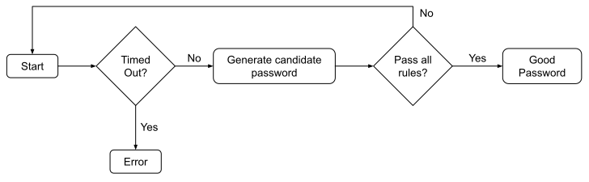

layout: false
class: compact
background-image: url(../../assets/images/backgrounds/HashiCorp-Content-bkg.png)
background-size: cover
name: Design
count: true

# Design

.design-text[
Password policies fundamentally have two parts: a length, and a set of rules that a password must adhere to. Passwords are randomly generated from the de-duplicated union of charsets found in all rules and then checked against each of the rules to determine if the candidate password is valid according to the policy. See Candidate Password Generation for details on how passwords are generated prior to being checked against the rule set.
]

???

Password policies have 2 basic parts. The length and a set of rules that the password has to follow.

--

.design-text[
A rule is an assertion upon a candidate password string that indicates whether or not the password is acceptable. For example: a "charset" rule states that a password must have at least one lowercase letter in it. This rule will reject any passwords that do not have any lowercase letters in it.]

???

A rule is basically what a candidate password string needs to follow in order to be deemed acceptable. An example would be a rule that says you must have a lowercase letter in it.

--

.design-flow[]

???

Here's the flow of how the password policies work.

