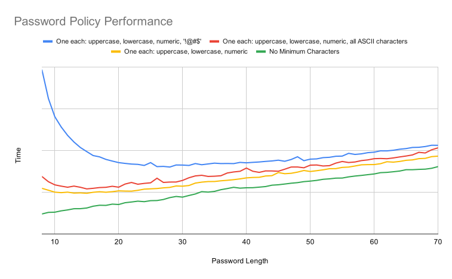

layout: false
class: compact, img-right
background-image: url(../../assets/images/backgrounds/HashiCorp-Content-bkg.png)
background-size: cover
name: Performance Characteristics
count: true

.performance-chart[]

# Performance Characteristics

.performance-text[The more restrictive the password policy is, the longer it will take to generate a password. This generalization isn't always true, but is a general guideline. The performance curve can be generalized:

`(time to generate a candidate password) * (number of candidate passwords generated)`

Where the number of times a candidate password needs to be generated is a function of how likely a given candidate password does not pass all of the rules. 

The graph on the right shows some example policy configurations with their performance.]

???

The general rule with password generation is the more restrictive the password policy, the longer it will take to generate a password. The performance curve can be summed up as time to generate a candidate password * the number of candidate passwords generated.

The graph on the right shows some common password policies and their performance.
